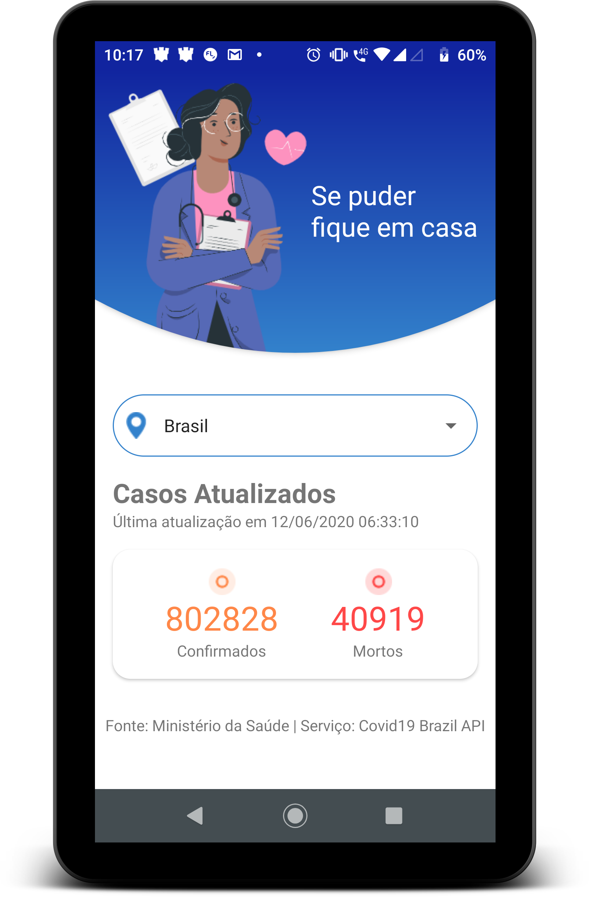

# Covid-19

Aplicativo Android desenvolvido em Kotlin para mostrar os casos e vítimas do Coronavírus (Covid-19).

[Download](/covid-19.apk)

> Fonte: Ministério da Saúde | Serviço: Covid19 Brazil API
